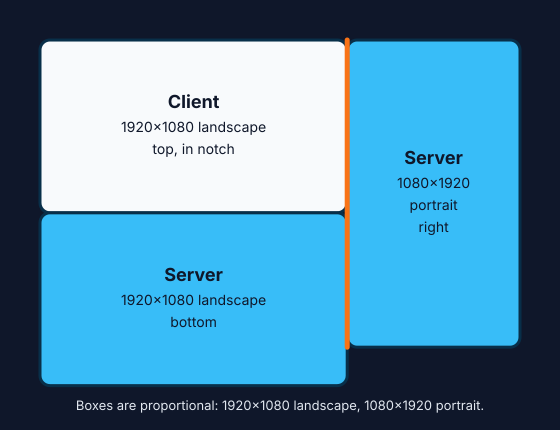
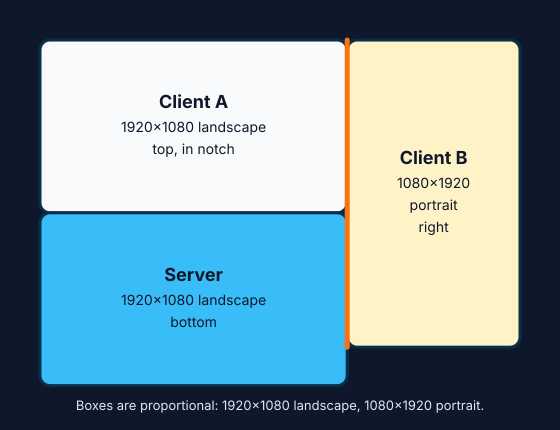
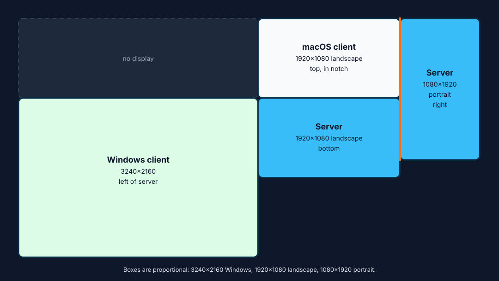

# Barrier macOS Apple Silicon fork

This repository is the iBetterAI-maintained macOS Apple Silicon fork of
[upstream Barrier](https://github.com/debauchee/barrier).

It keeps upstream Barrier as the base project and adds macOS-specific builds,
display-routing behavior, and compatibility fixes for this fork. For general
Barrier usage, supported platforms, FAQ, source history, and upstream project
details, see the [upstream Barrier repository](https://github.com/debauchee/barrier).

## Why Barrier 3.4.0?

**Your desk is not always a straight row of screens, and it does not stay the
same shape. Barrier 3.4.0 is built for that reality.**

[Apple Universal Control](https://support.apple.com/guide/mac-help/mchl412faecf/mac)
is convenient when nearby Macs and iPads use the same Apple Account. Barrier
3.4.0 tackles a different class of setup: several physical displays, a server
Mac that moves between desks, monitor combinations that change when you dock or
close a lid, client displays that should be allowed to sleep, and existing
Windows or Linux machines that still run Legacy Barrier.

| Real-world setup | What Barrier 3.4.0 does | Why it matters |
| --- | --- | --- |
| Screens form an L-shape or meet along only part of an edge | Models supported macOS displays as real rectangles and routes between modern fork peers through the edge segments that physically touch | The pointer crosses where the monitors meet instead of treating a multi-display Mac as one large rectangle |
| The server Mac travels with you | An opt-in macOS client watches for its explicitly paired server using configurable Bluetooth signal thresholds, matching Bonjour identity, and topology readiness | Take the server away and the client waits; bring that server back nearby and the normal Barrier connection can resume automatically |
| Docking, closing the lid, or attaching external monitors changes the server layout | Lets you save one freeform Barrier profile for each exact server display topology, then selects the matching saved profile automatically | Create each layout once instead of rearranging Barrier every time; an unknown layout pauses switching rather than sending the pointer to the wrong screen |
| An unused client display goes to sleep | Wakes a connected macOS client display when the pointer enters; an offline Mac can also receive a best-effort Bonjour network-wake request when **Wake for network access** is enabled | Barrier does not need every client display kept bright all day just to remain useful |
| The desk includes older Windows, Linux, or macOS Barrier peers | Negotiates Legacy Barrier 2.4-compatible protocol behavior while modern 3.x peers retain enhanced display geometry | Keep the machines you already use instead of requiring an all-Apple desk or a simultaneous upgrade |

Universal Control may already cover a fixed Mac-and-iPad desk. Barrier 3.4.0 is
for the desk that changes shape, crosses operating systems, or needs explicit
control over when and where machines connect.

## Download

- Use [GitHub Releases](https://github.com/ibetterai/barrier/releases) to view
  reconstructed notes. Apple Silicon DMGs appear there when a release includes
  a verified binary asset.
- See the [changelog](CHANGELOG.md) and
  [feature and fix ledger](docs/history/feature-fix-ledger.md) for the
  reconstructed public product history.

The published Barrier binary targets Apple Silicon and has an effective
macOS 26.0 minimum because of its bundled dependencies. Before attaching a
future DMG, verify every bundled Mach-O deployment target together with its
Developer ID signature, Apple notarization ticket, stapling, and offline
Gatekeeper acceptance.

## What this fork adds

- Native Apple Silicon macOS build and release packaging.
- Dynamic macOS physical-display geometry support.
- Non-rectangular and L-shaped monitor routing.
- Freeform server configuration that follows the live macOS Displays layout
  when displays move and the configuration is re-saved.
- Exact display-topology profiles that restore the saved freeform layout for
  each physical macOS display arrangement and pause cross-machine switching
  when the current arrangement is unknown.
- Optional macOS Bluetooth proximity gating, so a client starts only while its
  explicitly paired server is nearby, discoverable, and topology-ready, with
  pairing-scoped Connect and Departure signal thresholds.
- Optional client signal sharing, so a server can display the filtered RSSI and
  last-seen state of associated nearby clients while Proximity Settings is open.
- Cross-machine edge routing based on real display rectangles, while preserving
  normal local macOS transitions between displays on the same host.
- Freeform edge-gap tolerance so visually adjacent screens keep their intended
  links even when saved canvas coordinates contain small rounding gaps.
- Correct right/bottom edge coordinate mapping for freeform partial links, so a
  cursor entering a neighboring screen does not bounce back to the source screen.
- macOS display labels in the freeform canvas, using OS-provided display names
  when available.
- Client display wake-on-entry when the target macOS display system is asleep.
- Consistent perceived direction for Magic Mouse and trackpad two-finger
  vertical and horizontal scrolling across hosts.
- macOS menu bar fixes so Barrier windows such as settings and logs reliably
  come to the foreground.
- Magic Mouse two-finger left/right Spaces swipe forwarding. When the pointer is
  on a macOS client, the server detects the swipe intent and the client injects
  the native `Control` + left/right Space-switching shortcut.
- This fork Barrier (3.3.0 and above) restores interoperability with Legacy
  Barrier (2.4.0 and before). Protocol 1.6 peers receive only
  Legacy Barrier-compatible messages; this fork's peers keep enhanced display
  geometry and display names.

## Dynamic display topology profiles

When the server's macOS display arrangement is stable, open the server
configuration, arrange the Barrier screens, and save the profile. Barrier
associates that freeform layout with the exact physical display topology. It
selects the matching profile automatically after a display change and pauses
cross-machine switching when no saved profile matches.

A brief zero-display interval, such as a monitor reconnecting, uses a grace
period instead of immediately disconnecting clients. Save a new profile after
intentionally changing the physical display arrangement.

## macOS proximity-gated connections

Proximity gating is opt-in and available on macOS:

1. On the server, open **Proximity Settings…** from the Barrier menu and enable
   **Enable proximity advertising**.
2. On the client, open **Proximity Settings…**, select the nearby server, and
   choose **Pair**.
3. Enable **Enable proximity-gated connection**, adjust the **Connect signal**
   and **Departure signal** values if needed, and save the settings.

The client starts only when the paired Bluetooth identity is nearby, the exact
paired Bonjour service is present, and the server reports a ready display
topology. Bluetooth permission is required on both Macs.

Bonjour controls proximity identity and readiness independently from the
network route. With **Auto config** off, Barrier connects to the configured
**Server IP** after the paired server becomes eligible. With **Auto config**
on, Barrier connects through the paired Bonjour hostname instead.

Each pairing defaults to connecting at `-75 dBm` or stronger and beginning the
sustained-departure countdown at `-90 dBm` or weaker. The controls cover
`-100 dBm` through `-30 dBm`; a saved pairing must keep Connect at least
`15 dB` stronger than Departure. A less-negative value is stronger. **Reset
defaults** restores `-75/-90` without re-pairing.

To let the paired server display this client's nearby signal, enable **Share
nearby signal with paired server** on the client. This option is off by default,
including after an upgrade. An opted-in client appears after completing a
normal Barrier connection and establishing an unambiguous local association.
The server scans for its filtered RSSI only while the server's **Proximity
Settings…** dialog is open. The client advertises an opaque, pair-scoped
routing ID; it is a local routing hint, not Barrier authentication.

Sleeping-client wake remains separate from Bluetooth signal sharing. Moving
toward a configured offline client can request a rate-limited Bonjour network
wake whether or not the server is scanning for RSSI. The client Mac must have
**Wake for network access** enabled; Bluetooth presence alone is not a
guaranteed Mac wake mechanism.

If Bluetooth is temporarily unavailable, **Connect Anyway** bypasses only the
Bluetooth check for the current app session. Bonjour identity, network
availability, and topology readiness remain required. Choose **Resume
Proximity Gating** to end the override.

## Example L-shaped routing scenarios

This fork Barrier (3.3.0 and above) is designed for layouts that Apple
Universal Control does not handle well, especially when the useful
cross-machine edge is only part of a display edge rather than a full
rectangular side.

### Two machines: client display in the server L-shape notch

Use this when the server Mac has two displays:

- a landscape display along the bottom
- a portrait display on the right

The client has one landscape display placed above the server's landscape
display, in the open notch created by the server's L-shaped local layout:

Barrier routes the pointer through the real adjacent edges instead of treating
the server as one rectangular bounding box. The server Mac still owns the normal
local transition between its landscape and portrait displays; Barrier owns only
the cross-machine transition into the client display.

### Three machines: portrait display belongs to a third machine

Use this when the bottom landscape display is the server machine, the top
landscape display is one client, and the right portrait display is another
client:

Each remote machine contributes its own display rectangle. Barrier can route
from the bottom server display to the top client through the notch, and from the
server to the portrait client on the right, without requiring all three screens
to collapse into one rectangle.

### Four machines: Windows client on the left of the server

Use this when the two-machine L-shaped layout also has a Windows machine on the
left side of the server's bottom landscape display:

The Windows client can use the normal rectangular Barrier edge on the left,
while this fork's macOS peers keep the enhanced L-shaped partial-edge routing on
the top and right.

## Compatibility

Use this fork Barrier (3.3.0 and above) for enhanced display geometry and
Legacy Barrier (2.4.0 and before) compatibility.

- This fork Barrier (3.3.0 and above) works with Legacy Barrier (2.4.0 and
  before) peers by negotiating old-peer protocol behavior and suppressing
  newer display metadata unless the peer supports it.
- This fork Barrier peers keep enhanced multi-display and L-shaped routing when
  both sides support protocol 1.7.
- Legacy Barrier (2.4.0 and before) peers use rectangular-screen fallback
  behavior.
- This fork Barrier's versions less than 3.3.0 are superseded because they may
  not interoperate with Legacy Barrier (2.4.0 and before) peers.
- This fork Barrier (3.3.0 and above) keeps old-peer compatibility and fixes
  freeform partial-edge routing regressions in multi-monitor macOS layouts.

## Known limitations

- Apple Silicon macOS is the only packaged target published by this fork.
- A true headless/background macOS service is not implemented. Use the
  macOS app/session path.
- Magic Mouse Spaces swipe forwarding is macOS-specific and maps to the target
  Mac's Space-switching shortcut path, not a general-purpose gesture relay.
- If the target Mac's Mission Control keyboard shortcut for moving left/right a
  Space is disabled or remapped away from `Control` + left/right arrow, Spaces
  switching may not occur until that macOS setting is restored.

## Contact and support for this fork

For issues specific to this macOS Apple Silicon fork, open a GitHub issue.

## Upstream Barrier

Use upstream Barrier for:

- Windows, Linux, Intel macOS, and BSD releases.
- General documentation and FAQ.
- Upstream issues, contribution guidance, and source history.

Upstream repository: <https://github.com/debauchee/barrier>
